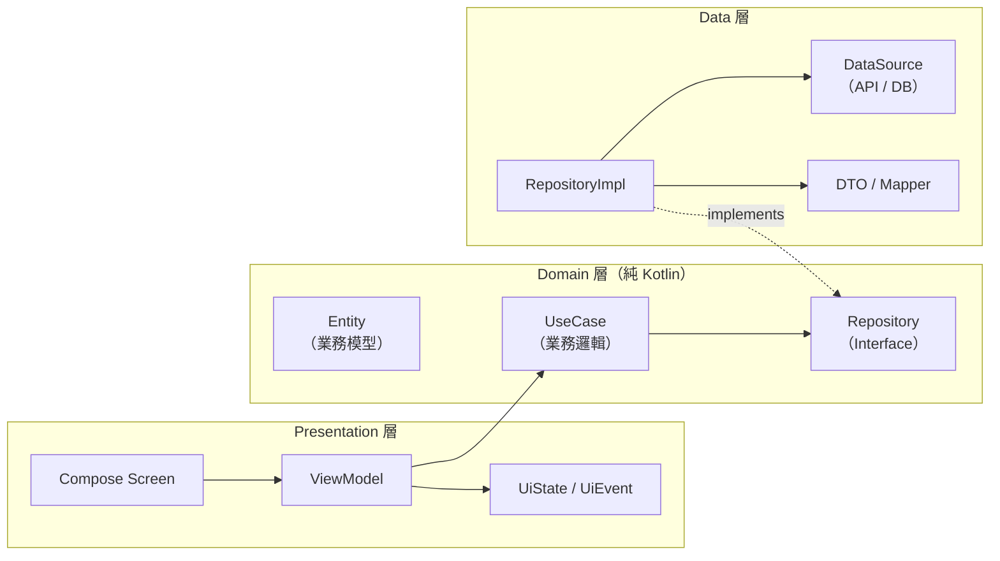

---
paths:
  - "**/*.kt"
  - "**/*.kts"
  - "**/build.gradle.kts"
  - "**/build.gradle"
---

# 架構規範 — Clean Architecture × 多模組

---

## 1. 三層架構



**依賴方向**: `Presentation → Domain ← Data`

### 程式碼層依賴規則

| 層 | 可依賴 | 禁止依賴 |
|---|---|---|
| **Domain** | Kotlin Stdlib, Coroutines | Android SDK, Hilt, Retrofit, Room |
| **Data** | Domain, 框架 (Retrofit / Room / Hilt) | Presentation |
| **Presentation** | Domain (透過 UseCase), Hilt, Compose | Data 的具體實作 |

---

## 2. 多模組對應

三層架構在 Gradle 模組層面的落地方式。

```
                          :app
                        /  |  \
           :feature:home   |   :feature:payment   :feature:profile
               |     \     |       |     \
           :core:ui   :core:domain   :core:data
                    \      |       /
                     :core:common
```

### 模組層依賴規則

| 模組層級 | 可依賴 | 禁止依賴 |
|---|---|---|
| `:app` | 所有 feature 與 core 模組 | — |
| `:feature:*` | `:core:*` | 其他 `:feature:*` |
| `:core:domain` | `:core:common` | `:core:data`, `:core:ui`, Android SDK |
| `:core:data` | `:core:domain`, `:core:common` | `:core:ui`, `:feature:*` |
| `:core:ui` | `:core:common` | `:core:data`, `:core:domain` |

**跨 Feature 通訊**：透過 `:core:domain` 的共用介面或 Navigation Route，禁止直接引用另一個 feature。

### Core 模組職責

| 模組 | 內容 |
|---|---|
| `:core:common` | Extension functions, Utilities, 共用常數 |
| `:core:domain` | 跨 feature 共用的 Entity、Repository Interface |
| `:core:data` | 網路 / 資料庫基礎設施（OkHttp、Room Database Builder、共用 Interceptor） |
| `:core:ui` | Design System、共用 Composable、Theme |

---

## 3. Feature 模組目錄結構

每個 Feature 模組獨立擁有完整的 Clean Architecture 三層：

```
feature/payment/
├── build.gradle.kts
└── src/main/kotlin/com/example/payment/
    ├── domain/
    │   ├── model/Payment.kt                    // Entity
    │   ├── repository/PaymentRepository.kt     // Interface
    │   └── usecase/GetPaymentHistoryUseCase.kt
    ├── data/
    │   ├── remote/PaymentApi.kt                // Retrofit Interface
    │   ├── remote/PaymentDto.kt
    │   ├── local/PaymentDao.kt                 // Room DAO
    │   ├── mapper/PaymentMapper.kt             // DTO ↔ Entity
    │   ├── repository/PaymentRepositoryImpl.kt
    │   └── di/PaymentDataModule.kt             // Hilt @Module
    └── presentation/
        ├── PaymentViewModel.kt
        ├── PaymentUiState.kt
        ├── PaymentUiEvent.kt
        └── screen/PaymentScreen.kt             // Composable
```

---

## 4. Build 配置要點

- **Convention Plugins** 統一管理共用 build 設定（compileSdk, minSdk, Compose compiler 等）。
- 所有版本號集中在 **Version Catalog** (`libs.versions.toml`)。
- Feature 模組之間使用 `implementation`，禁止 `api`，避免依賴洩漏。
- Core 模組視情況使用 `api` 向上暴露必要介面（如 `:core:domain` 的 Entity）。
